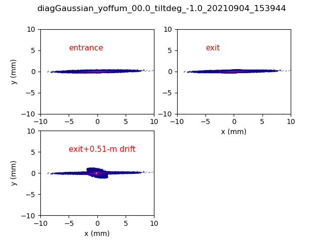

# warp simulation for the skewWake experiment


### Each case has the following file with * corresponding to the rootname: 

- diagGaussian_*figure.png  :  .png figure showing the (x,y) space 
                              before (top left), after (top right), 
			      the structure and after a 0.51-m drift
			      
- diagGaussian_*_init.npz      :  structured file with initial macroparticle 
                              distribution			      

- diagGaussian_*_final.npz      : structured file with macroparticle 
                              distribution at the exit of the structure
			      
- diagGaussian_*_scrn.npz      : structured file with macroparticle 
                              distribution at the exit of the structure


### To load the file and load structured variables
```python
import numpy as np

fileiN=np.load('diagGaussian_yoffum_00.0_tiltdeg_00.0_20210904_142002_scrn.npz')
# this is the particle positions (xs, ys, zs)
xs=fileiN['xs']
ys=fileiN['ys']
zs=fileiN['zs']
# this is the particle velocity (uxs, uys, uzs) following ARP convension u_i=c gamma*beta_i or i in[x,y,z]

uxs=fileiN['uxs']
uys=fileiN['uys']
uzs=fileiN['uzs']
```			      
An example is provided in the readexple file which can be run with the argument:  
python readexple.py diagGaussian_yoffum_00.0_tiltdeg_02.0_20210904_143344require 
	     		      
### The two configurations run are

- diagGaussian_noUpperSlab: Gaussian beam above a single slab
- diagGaussian: Gaussian beam injected in the structure

For all cases the beam was located at (x,y)=(0,0) [yoffum=0] and only the tilt was varied. 

### The structure considered is:
- Ls  =  15e-2     # length of the structure
- W   =  50e-3     # along x
- a   =  0.914e-3/2.    # half vacuum gap
- b   =  a+5e-3    # half conductor gap 


### the beam parameters are as follows:

beam_Np    = 250000
x0         = 0.0  # initial beam position 
y0         = yoff  # initial beam position 
z0         = z0Beam # initial beam position 
beam_weight= beam_Q / (beam_Np*echarge)


#### Beam normalized emittance
- beam_emit_x = 200e-6  # in m.rad
- beam_emit_y = 2e-6    # in m.rad

#### beam sizes at the waist located at strcuture center (w/o accounting for transverse wakes)
- beam_xrms   = 2.0e-3 m 
- beam_yrms   = 0.10e-3 m 
- beam_zrms   = 640e-6 m 
- beam_qbunch = 2e-9 C

_yoffum_00.0_tiltdeg_00.0_YYYYMMDD_HHMMSSfigure.png


![case](./diagGaussian_yoffum_00.0_tiltdeg_01.0_20210904_150921figure.png





 
